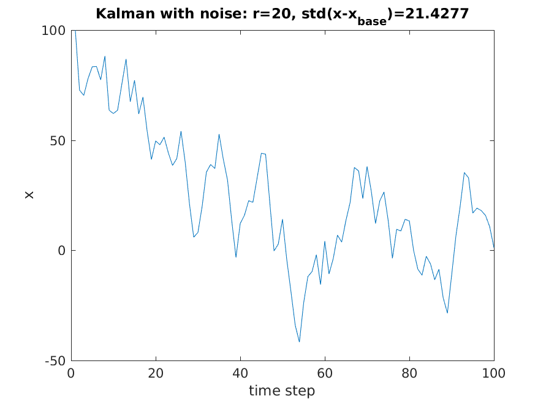
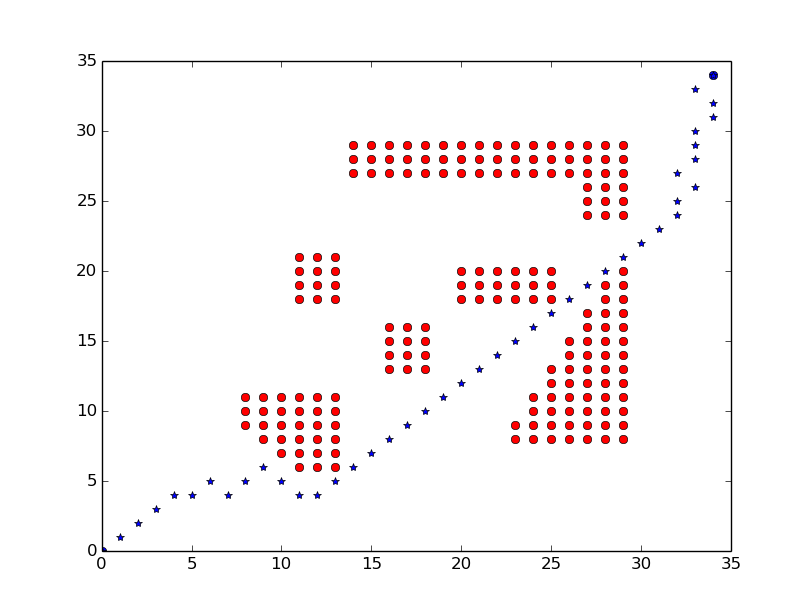
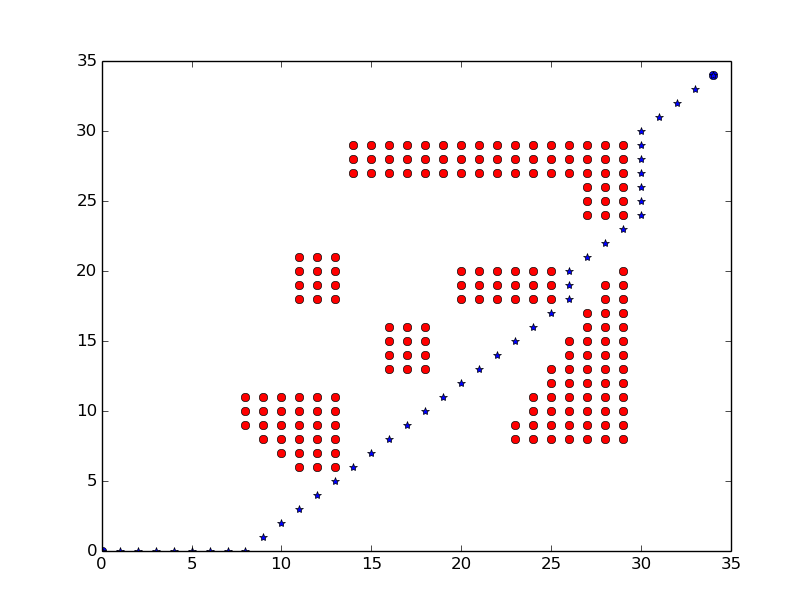

ROB301 Introduction to Robotics
===
##Lejo Labs: Using Java to control Lego Robots
#### Lab1
- HelloRob.java
- MotorTest.java
- DoubleMotor.java
- GuiChuMotor.java
- ColorRedTest.java
- ColorIDTest.java
- ColorAmbientTest.java
- SonicTest.java
- TouchTest.java

#### Lab2
- PickPlace.java
- SimpleTraj.java
- ObjDetect.java

#### Lab3
- ColorSensorCal.java
- ForwardTest.java
- BangBangControl.java
- PController.java
- PIController.java
- PIDController.java

#### Lab4
- FollowWall.java
- TeachNRepeat.java

## Lego Project
TODO

## Misc
- kalman.m (Kalman Filtering in 1d)  

- PathPlanning.py

